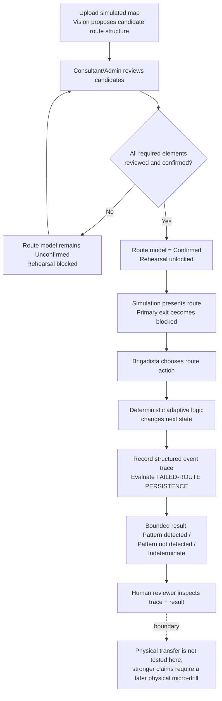
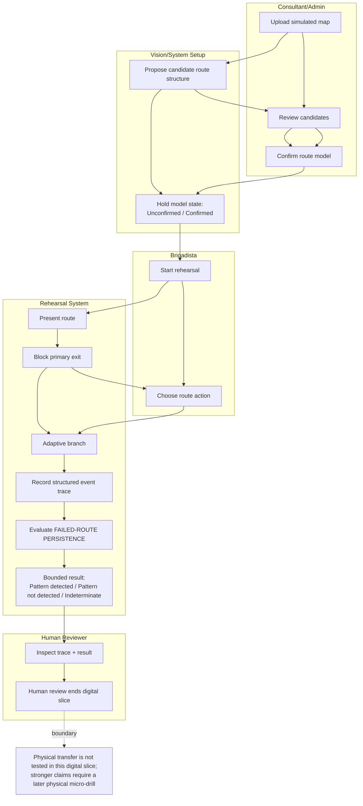

# WEEK 6 — PACKET

Name: Ana María Matas  
Role: Technologist

## 1. Problem in my words

Predictable drills can teach people to repeat a familiar route without showing what they do when that route fails. The gap is not participation; it is whether observable behavior changes under a disrupted condition. If a school records only completion, it can create false preparedness: confidence without evidence that the person adapted when the normal plan stopped working.

## 2. Exact user

The primary user is one adult brigadista in a private CDMX school completing a single blocked-route rehearsal. A Consultant/Admin is the secondary setup actor who prepares and validates the route model before the rehearsal. This user is narrow enough because the slice tests one defined responsibility and one observable decision without assuming broader demographics, abilities, or needs we have not researched.

## 3. Success definition

Before the module closes, a simulated evacuation-map image can be uploaded, vision can propose candidate route structure, and a Consultant/Admin can correct and confirm it before use.  
A brigadista can complete the blocked-primary-exit browser rehearsal, with deterministic adaptive branching responding to the route action taken.  
The system produces a structured event trace and exactly one result for FAILED-ROUTE PERSISTENCE: Pattern detected, Pattern not detected, or Indeterminate.  
A Human Reviewer can inspect the trace and the bounded software result.

**NON-SUCCESS:** Even if all of this works, we are not claiming that the brigadista or school is prepared, competent, safe, or proven to perform the same way in a real earthquake.

## 4. Image-generated mockup

Route Setup & Human Confirmation → Blocked-Exit Rehearsal → Trace & Human Review.

## 5. Feature flow

## 6. Actor swimlane

## 7. Benchmark

“The best existing solution on Earth for this is XVR / D2PuLs; mine differs or localizes by adapting its scenario-control, action-logging, and human-review logic into a cheaper browser-based rehearsal for one blocked-route behavior in a Mexican school context.”

## 8. Long view

“If this slice works, the full product becomes a modular rehearsal system in which each new technology is added only when it produces evidence that a simpler method cannot. Human-validated setup, controlled scenarios, observable event traces, bounded pattern detection, and corrective-action follow-up remain the core, while human judgment and physical testing set the limits of what the evidence can claim. The product grows only when new simulation or adaptive capabilities prove they add decision-relevant value, never by turning narrow digital behavior into a readiness score or permanent judgment about a person.”

## 9. Scope cut

- No deployment in a real school and no use of a real evacuation plan.
- No validation that any route is safe, compliant, or appropriate for a real emergency.
- No VR, WebXR, headset experience, or full 3D digital twin.
- No additional scenarios beyond one blocked-primary-exit rehearsal.
- No behavioral patterns beyond FAILED-ROUTE PERSISTENCE.
- No physical-drill execution or claim of real-world transfer inside the product.
- No readiness score, competence rating, ranking, psychological inference, gaze/emotion analysis, or permanent individual preparedness profile.
- No automatic route-safety recommendations or automatic vision authority; every extracted route element requires human review before use.
- No production-scale authentication, database, user-history, integrations, or administrative infrastructure unless the assignment’s Security Floor explicitly requires a minimal version.

The scope is intentionally narrow so the prototype can prove one complete, auditable rehearsal-and-evidence loop without adding capabilities that the behavior or assignment does not require.

### Vision boundary

This prototype does **NOT** support arbitrary evacuation maps.

It uses one known, clearly labeled **SIMULATED SCHOOL** map with a very small route structure.

Vision only proposes a limited set of candidate:
- nodes
- exits
- connections
- labels

The goal is to demonstrate the human-validated vision workflow, not solve general evacuation-map understanding.

## 10. Architecture

### Frontend — browser app

- Consultant/Admin uploads the one simulated-school map.
- Shows vision-proposed nodes, exits, connections, and labels as editable candidate data.
- Prevents rehearsal access while `routeModel.status !== "confirmed"`.
- Runs the blocked-exit rehearsal using the confirmed route model.
- Records the brigadista’s route actions into a structured event trace.
- Shows the bounded result and trace to the Human Reviewer.

### Server/API

- Accepts only the simulated-map image upload.
- Validates image type and file size before processing.
- Sends the image to Gemini server-side.
- Receives candidate structured data and schema-validates it before returning anything to the frontend.
- Keeps API credentials server-side in Vercel environment variables.

### Vision

Simulated map image  
→ vision proposes candidate structure  
→ schema validation  
→ Consultant/Admin reviews/corrects  
→ human-confirmed route model

Vision never sets the model to Confirmed and never determines route safety.

### Route-model validation

The confirmed model contains only:
- nodes
- exits
- allowed connections
- simple labels

Unresolved or invalid elements keep the model Unconfirmed.

### Rehearsal state

Once confirmed, deterministic rules:
- present the normal route;
- block the Primary Exit;
- select the next state from the brigadista’s route action.

### Event trace

Record only structured scenario events needed for this session, such as:
- scenario version
- blockage presented
- route action chosen
- next state
- timestamps

No psychological or preparedness attributes are created.

### Pattern evaluation

A deterministic function evaluates only FAILED-ROUTE PERSISTENCE and returns exactly:

- Pattern detected
- Pattern not detected
- Indeterminate

No LLM or vision model participates in this judgment.

### Human review

The reviewer sees:
- event trace
- bounded result
- validated reviewer-note field

The software does not turn this into a preparedness score or physical-transfer claim.

### Persistence

**Ephemeral / in-memory:**
- uploaded simulated image
- raw vision response
- candidate route structure
- confirmed route model
- rehearsal state
- structured event trace
- pattern result
- reviewer note

**Persisted:**  
Nothing required.

A database is not needed for the locked slice.

## 11. Stack

| Layer | Technology | Exact job | Why it earns its place |
|---|---|---|---|
| Web app | Next.js + React + TypeScript | Setup UI, confirmation gate, rehearsal, trace, bounded result, human review | One small codebase can support both browser UI and server endpoints |
| Input validation | Zod or equivalent schema validation | Validate vision candidate structure and API inputs | Prevents untrusted model output from becoming usable route data |
| Vision | Gemini API — `gemini-2.5-flash-lite`, called server-side | Read the one simulated-school map and propose schema-bounded candidate nodes, exits, connections, and labels; output is validated and then human-reviewed before use | Supports image input + structured extraction with no extra infrastructure; it reduces setup work while retaining zero authority over the confirmed route model |
| Server endpoint | Next.js server/API route | Validate upload, call vision provider, protect secret, return schema-checked candidates | Keeps credentials and untrusted vision processing off the client |
| Simulation | Browser-rendered route states | Present the normal route and blocked-primary-exit scenario | This is the actual rehearsal environment |
| Adaptive logic | Deterministic TypeScript state/rule logic | Change the next simulation state from the brigadista’s selected action | Satisfies adaptive logic without unnecessary ML or unpredictable safety decisions |
| Evidence | Typed in-memory event trace | Record the small sequence of observable scenario events | Provides the evidence required for bounded pattern evaluation |
| Pattern evaluation | Deterministic TypeScript function | Evaluate only FAILED-ROUTE PERSISTENCE and return Pattern detected / Pattern not detected / Indeterminate | Keeps the result reproducible, auditable, and narrower than the claim |

## 12. Security Floor

### 1. No secrets in code or repo — APPLIES.

The Gemini API key lives only in Vercel environment variables and is accessed from the server/API route.

It is never exposed to client code or committed to the repo.

### 2. Auth if personal data is stored — N/A.

This prototype stores no personal data and has no permanent participant history.

### 3. Row Level Security for Supabase user-data tables — N/A.

We are not using Supabase or storing user rows.

### 4. Every form validates its input — APPLIES.

Validate:
- image MIME type
- maximum file size
- reviewer-note length
- route actions against an allowlist
- route-model schema
- vision-output schema

Nothing raw goes directly into storage or an AI prompt without validation.

### 5. No real personal data in demos/seeds — APPLIES.

All participant, school, map, scenario, and event-trace data are invented and visibly labeled **SIMULATED**.

## 13. Test Plan

### A. CORE ACCEPTANCE TESTS

| Test | Action | Expected result |
|---|---|---|
| Valid simulated-map upload | Upload the approved simulated-school image | File is accepted and sent to the server-side vision step |
| Invalid file type | Upload a non-image file | Upload is rejected with a clear validation message |
| Oversized upload | Upload an image above the allowed size | Upload is rejected before any vision call |
| Valid vision output | Vision returns schema-valid candidate nodes, exits, connections, and labels | Candidates appear for Consultant/Admin review; route model remains Unconfirmed |
| Malformed/incomplete vision output | Return missing, invalid, or incorrectly typed fields | Output is blocked by schema validation and cannot become a usable route model |
| Human-validation gate | Leave at least one required element Suggested / Needs review | Confirm route model remains disabled; rehearsal cannot start |
| Confirmed model unlocks rehearsal | Review and confirm all required route elements | Route model becomes Confirmed and the rehearsal becomes available |
| Blocked-primary-exit state | Start the rehearsal | Normal route appears, then Primary Exit becomes visibly blocked |
| Deterministic route actions | Trigger each allowed route action | Each action produces its predefined next state; invalid actions are rejected |
| Structured event trace | Complete a rehearsal path | Expected scenario events, route actions, state changes, and timestamps are recorded |
| Pattern detected | Use a trace containing the predefined failed-route-persistence sequence | Output is exactly `Pattern detected` |
| Pattern not detected | Use a valid trace without the predefined sequence | Output is exactly `Pattern not detected` |
| Indeterminate | Use an invalid/incomplete session trace that cannot be interpreted honestly | Output is exactly `Indeterminate` |
| Human review | Open the completed session as reviewer | Reviewer can inspect the event trace and bounded result and add a validated note |
| Claim boundary | Inspect all setup, rehearsal, and review screens | No readiness score, competence judgment, psychological inference, or physical-transfer claim appears |

### B. DRAGON STACK PROOF

- **Vision:** Change a candidate element produced from the uploaded map and verify that only the human-confirmed route model enters the rehearsal.
- **Adaptive logic:** Select different allowed route actions and verify that each produces its predefined next simulation state.
- **Multiplicative stack:** Verify that the uploaded map informs the confirmed route model, that model drives the simulated route, and the participant action inside that simulation drives the deterministic branch and resulting event trace.

### C. SECURITY FLOOR TESTS

- **Secrets:** API key not exposed client-side or in repo.
- **Input validation:** image type/size, reviewer-note length, route-action values, route-model schema, vision-output schema.
- **Fictional data only:** all school/map/demo content visibly simulated.
- **No personal-data persistence:** session reset leaves no permanent participant profile/history.
- **Malformed vision output:** blocked before becoming usable route data.

Auth and RLS remain N/A.

### D. MECHANICAL PASS PLAN

This is a **FUTURE** test.

After Deploy 1:

1. Run Core Acceptance, Dragon Stack, and Security Floor tests.
2. Record actual failures with action, expected result, observed result, and screenshot/evidence.
3. Find at least one **REAL** bug during testing.
4. Fix the cause without expanding scope.
5. Commit the fix.
6. Redeploy.
7. Repeat failed test + regression tests.
8. Document before → fix → after.

**IMPORTANT:** Do **NOT** invent the bug in the Packet.

### E. PERSONA TEST PLAN

This is also a **FUTURE** test.

Do **NOT** write as if the Persona Test already happened.

**Synthetic persona:**  
An adult brigadista in a private CDMX school completing one short browser-based blocked-route rehearsal.

Do not add unresearched demographics, expertise, disability status, or background.

Later, after the working app exists, capture **REAL** screenshots from the deployed app in this order:

1. Rehearsal starting state with the controlled simulated route visible.
2. Primary Exit becomes blocked and available route actions appear.
3. Adaptive next state after the brigadista selects an action.

There is currently no separate participant-facing result/completion screen in the locked design.

The Trace & Human Review screen is excluded because it belongs to the Human Reviewer / Consultant-Admin.

Use this fresh-chat instruction later:

> “Act as the adult brigadista described above. Review these product screenshots in chronological order. For each screenshot, explain what you think is happening, what you think you are supposed to do, what action you believe you took, what you think will happen with that action, and anything that is unclear or misleading. Do not assume functionality that is not visible.”

Log confusion about:
- whether the brigadista understands this is simulated;
- whether the blocked Primary Exit is obvious;
- whether available route actions are understandable;
- whether the next state clearly follows the selected action;
- whether the brigadista incorrectly believes the exercise proves preparedness or real-world performance;
- anything that causes hesitation, incorrect choice, or contamination of the behavioral signal.

**Worst issue to fix:**  
Choose the confusion that most threatens a locked Blueprint condition or makes recorded behavior less trustworthy because of the interface rather than the rehearsal itself.

After fixing it:
- recapture the affected screenshot;
- retest it in a fresh Persona chat.

Do **NOT** invent Persona findings now.

### F. KILL / FAILURE CONDITIONS

1. **Vision kill condition:**

   “Kill vision if a human can build the same small route model manually with equal or less effort than reviewing and correcting the vision output.”

2. **Decision-value failure:**

   If the FAILED-ROUTE PERSISTENCE result does not give a human reviewer evidence useful enough to change or prioritize a real training decision, the measurement is not earning its place.

3. **Interface-confound failure:**

   If the system cannot reliably distinguish interface/session failure from participant behavior, the affected session must remain Indeterminate; if this occurs often enough to undermine interpretation, the rehearsal design must be revised rather than treating interface errors as human errors.

## 14. Locked build summary

**Primary user:**  
one adult brigadista in a private CDMX school

**Secondary actor:**  
Consultant/Admin

**Primary behavior:**  
response to a blocked Primary Exit

**Measured pattern:**  
FAILED-ROUTE PERSISTENCE

**Software output:**  
Pattern detected / Pattern not detected / Indeterminate

**Human authority:**  
final interpretation remains human

**Dragon Stack:**  
browser simulation  
+ deterministic adaptive logic  
+ vision-assisted setup with mandatory human confirmation

**Physical-transfer boundary:**  
not tested in this digital slice

**Shadow boundary:**  
no preparedness score and no permanent individual preparedness profile
